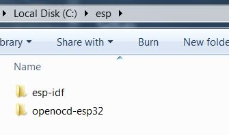
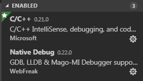
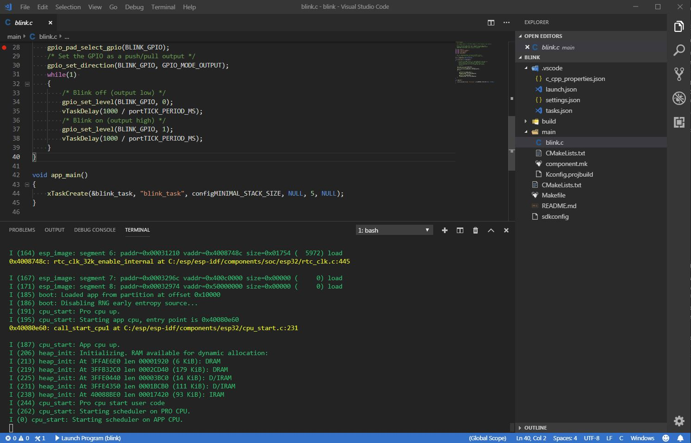
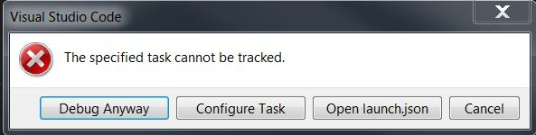
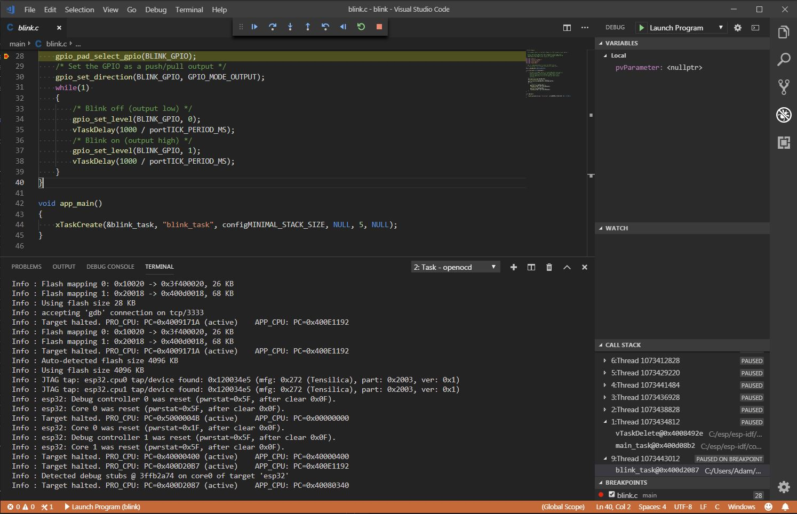
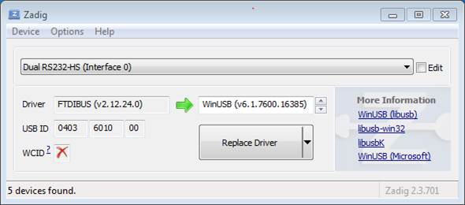

# VS Code ESP32 JTAG Debug - Example Project #
## Notes ##
This guide assumes you have setup the esp-idf environment in Windows and can currently run `make flash monitor` and other commands succesfully. [Start with the ESP setup guide if not.](https://docs.espressif.com/projects/esp-idf/en/stable/get-started/index.html#setup-toolchain)

There are other existing setup guides but this serves as an example project where you can step-by-step debug inside VSCode with one-click and with minimal setup.

The example project is the default blink example, the only things added is the SDKCONFIG (where you will need to change the COM port to flash) and the .vscode folder which contains the necessary files to allow for intellisense and debugging. The files assume you have the esp-idf and openocd folder in "C:\esp" and msys in "C:\msys32". If not simply change in the json files to where you have them.

## Setup ##
---

1. [Download openocd](https://github.com/espressif/openocd-esp32/releases) and extract in the "C:\esp" folder alongside the esp-idf.



2. Install the [native-debug extension](https://marketplace.visualstudio.com/items?itemName=webfreak.debug) and also the official C/C++ extension for VS Code.



3. Setup of drivers if necessary. See WROVER setup below if needed.

5. Open the blink folder in VS Code and change the COM port in sdkconfig to your ESP32.

4. Run `make flash` or `make flash monitor` (You can use Ctrl+J to bring up the integrated terminal)



5. `Launch Program` in the debug menu when complete. An error like popup may appear click debug anyway.





## Files ##
---
`c_cpp_properties.json` - Necessary for intellisense
```json
{
    "configurations": [
        {
            "name": "Windows",
            "includePath": 
            [
                "${workspaceFolder}/**",
                "C:/esp/esp-idf/components/**",
                "C:/msys32/opt/xtensa-esp32-elf/**"
            ],
            "browse": 
            {
                "path" : 
                [
                    "${workspaceFolder}/**",
                    "C:/esp/esp-idf/components/**",
                    "C:/msys32/opt/xtensa-esp32-elf/**"
                ]
            },
            "defines": [],
            "compilerPath": "C:/msys32/opt/xtensa-esp32-elf/bin/xtensa-esp32-elf-gcc.exe",
            "cStandard": "c11",
            "intelliSenseMode": "gcc-x64",
            "cppStandard": "c++11"
        }
    ],
    "version": 4
}
```

`launch.json` - Allows you to click to start debugging, starts openocd before running
```json
{
    "version": "0.2.0",
    "configurations": 
    [
        {
            "type": "gdb",
            "request": "launch",
            "name": "Launch Program",
            "target": "./build/${workspaceFolderBasename}.elf",
            "cwd": "${workspaceFolder}",
            "gdbpath": "C:/msys32/opt/xtensa-esp32-elf/bin/xtensa-esp32-elf-gdb",
            "autorun": 
            [
                "target remote :3333",
                "mon reset halt",
                "flushregs",
                "thb app_main",
                "c"
            ],
            "preLaunchTask": "openocd"
        }
    ]
}
```
`tasks.json` - Runs openocd, change the appimage_offset to where the binary is flashed on the ESP if you have changed partition_layout.csv. 0x10000 is the default. This will allow you to set breakpoints succesfully.

Also enter the correct .cfg, this file assumes you are using the WROVER-KIT.
```json
{
    "version": "2.0.0",
    "tasks": 
    [
        {
            "label": "openocd",
            "type": "shell",
            "isBackground": true,
            "options": 
            {
                "cwd": "C:/esp/openocd-esp32"
            },
            "command": "bin/openocd -s share/openocd/scripts -f interface/ftdi/esp32_devkitj_v1.cfg -f board/esp32-wrover.cfg -c \"init; halt; esp32 appimage_offset 0x10000\" ",
        },
    ]
}
```
`settings.json` - Integrated terminal which will open MSYS in the current working directory so you can run 'make flash' and other commands inside VS Code.
```json
{
    "terminal.integrated.shell.windows": "C:\\msys32\\usr\\bin\\bash.exe",
    "terminal.integrated.shellArgs.windows": ["--login", "-i"],
    "terminal.integrated.env.windows":
    {
        "MSYSTEM": "MINGW32",
        "CHERE_INVOKING":"1"
    }
}
```

### Windows WROVER-KIT setup ###
---
You can skip this step if not using the WROVER-KIT from Espressif.

[Full guide where this is extracted from here.](https://docs.espressif.com/projects/esp-idf/en/stable/api-guides/jtag-debugging/configure-wrover.html)
If using the WROVER-KIT make sure to connect the jumpers on the JTAG pins and install the correct drivers.


- Using standard USB A / micro USB B cable connect ESP32 WROVER KIT to the computer. Switch the WROVER KIT on.

- Wait until USB ports of WROVER KIT are recognized by Windows and drives are installed. If they do not install automatically, then then download them from http://www.ftdichip.com/Drivers/D2XX.htm and install manually.

- Download Zadig tool (Zadig_X.X.exe) from http://zadig.akeo.ie/ and run it.

- In Zadig tool go to “Options” and check “List All Devices”.

- Check the list of devices that should contain two WROVER specific USB entries: “Dual RS232-HS (Interface 0)” and “Dual RS232-HS (Interface 1)”. The driver name would be “FTDIBUS (vxxxx)” and USB ID: 0403 6010.
Configuration of JTAG USB driver in Zadig tool



- The first device (Dual RS232-HS (Interface 0)) is connected to the JTAG port of the ESP32. Original “FTDIBUS (vxxxx)” driver of this device should be replaced with “WinUSB (v6xxxxx)”. To do so, select “Dual RS232-HS (Interface 0) and reinstall attached driver to the “WinUSB (v6xxxxx)”, see picture above.

### Limitations ###
---
* The popup that appears is due to the way VS Code runs tasks. This can be ignored it doesn't affect the process. Just click debug anyway.

* Step over does not work correctly due to the way the ESP works with debugging. So when stepping over you do not bypass function calls you will always step into the function. You can workaround by just setting breakpoints to where you want to go and using continue.

### Useful Links + Further Reading ###
---
https://docs.espressif.com/projects/esp-idf/en/stable/get-started/index.html

https://docs.espressif.com/projects/esp-idf/en/stable/api-guides/jtag-debugging/index.html

https://higaski.at/vscode-esp32-debugging/

https://github.com/VirgiliaBeatrice/esp32-devenv-vscode/blob/master/tutorial.md
